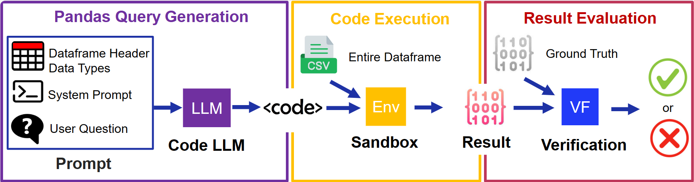

<p align="center">
     
</p>

# DataFrame QA: A Universal LLM Framework on DataFrame Question Answering Without Data Exposure

[[paper](https://openreview.net/forum?id=rDNj0enuhc)] [[poster](./assets/dataframe_qa_poster.pdf)] [[slides](./assets/dataframe_qa_slides.pdf)]



## News
- [2024/11] 🔥 **Our DataFrame QA paper is accepted by [ACML 2024](https://www.acml-conf.org/2024/).**

## TL;DR
A Universal LLM Framework on DataFrame Question Answering Without Data Exposure.

## Abstract
This paper introduces DataFrame Question Answering (QA), a novel task that utilizes natural language processing (NLP) models to generate Pandas queries for information retrieval and data analysis on dataframes, emphasizing safe and non-revealing data handling. Specifically, our method, leveraging a large language model (LLM), which solely relies on dataframe column names, not only ensures data privacy but also significantly reduces the context window in the prompt, streamlining information processing and addressing major challenges in LLM-based data analysis.

We propose DataFrame QA as a comprehensive framework that includes safe Pandas query generation and code execution. Various LLMs are evaluated on the renowned WikiSQL dataset and our newly developed UCI-DataFrameQA, tailored for complex data analysis queries. Our findings indicate that GPT-4 performs well on both datasets, underscoring its capability in securely retrieving and aggregating dataframe values and conducting sophisticated data analyses. This approach, deployable in a zero-shot manner without prior training or adjustments, proves to be highly adaptable and secure for diverse applications.

## Key Features
- **Data Privacy:** Utilizes only dataframe column names to ensure data privacy.
- **Efficient Processing:** Reduces the context window in the prompt, streamlining information processing.
- **Comprehensive Framework:** Includes safe Pandas query generation and code execution.
- **Versatile:** Proven effective on both WikiSQL and UCI-DataFrameQA datasets.
- **Zero-shot Deployment:** No prior training or adjustments required for deployment.


## Prompt & Example
<p align="center">
     
</p>

## Datasets
### WikiSQL Dataset
The WikiSQL dataset is utilized to evaluate the effectiveness of various LLMs in generating accurate Pandas queries for data retrieval and analysis.

### UCI-DataFrameQA Dataset
A newly developed dataset tailored for complex data analysis queries, providing a comprehensive benchmark for LLM performance in DataFrame QA tasks.

## Usage
To run the LLM on the DataFrameQA datasets, use the following commands:

### WikiSQL Dataset
```bash
python run_wikisql.py --model llama2-7b
```

### UCI-DataFrameQA Dataset
```bash
python run_uci_dataframeqa.py --model llama2-7b
```

## Conclusion
DataFrameQA represents a significant advancement in the field of data analysis, offering a secure and efficient method for generating Pandas queries using large language models. Its adaptability and zero-shot deployment make it a powerful tool for diverse applications, ensuring both data privacy and accurate information retrieval.

---

For more details, please refer to [Appendix](./appendix.pdf).

## Reference
If you find this project is helpful to your research, please consider to cite our paper:
```
@article{ye2024dataframe,
  title={DataFrame QA: A Universal LLM Framework on DataFrame Question Answering Without Data Exposure},
  author={Ye, Junyi and Du, Mengnan and Wang, Guiling},
  journal={arXiv preprint arXiv:2401.15463},
  year={2024}
}
```

